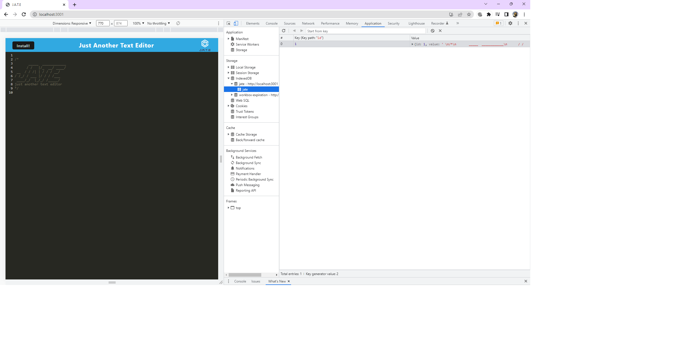

# Text Editor
  
  ## Table of Contents 
  - [Description](#description)
  - [Installation](#installation)
  - [Usage](#usage)
  - [license](#license)
  - [Contribution](#contribution)
  - [Testing](#testing)
  - [Screenshots](#Screenshots)
  - [Questions](#questions)
  - [Additional Info](#additional-info)
 
  ## Description:

  J.A.T.E was created as a simple text editor app that can function both online and offline, with a variety of data persistence options in order to ensure that data is not lost in any scenario. The application first looks to use the data in the indexedDB to populate the editor, then if it cannot access that it will use local storage. For use offline, this application can be downloaded to your desktop as an application.

  ## Installation:

  This program can be run through a browser using the link to the the deployed application. Alternatively, to run this application locally you will need to:

  - Clone this repository to receive all of the files.

  - Run "npm install" in the command line of your terminal to    set up all of the dependencies.

  - Run "npm start" to start the backend and serve the client.

  - Go to the url of the application (http//:localhost:3001) to begin using it.

  ## Usage:

  The app allows the user to view, add, edit, and delete categories, products, and tags.

  ## License:

 

  ## Contribution:

  All contributions are welcome.

  ## Testing:
  
  Testing on localhost.

  # ScreenShots:

  ## Questions
  [HERE](https://github.com/asrabilal)

  ## Additional Info:
  - Github: [asrabilal](https://github.com/asrabilal/texteditor.git)
  - Email: asra596@gmail.com 
  - Deployed link:[HERE](https://editor.herokuapp.com/)

    
    
